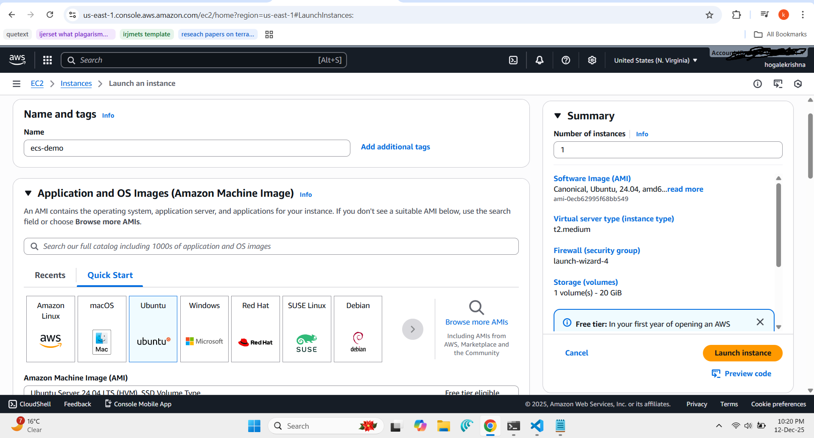
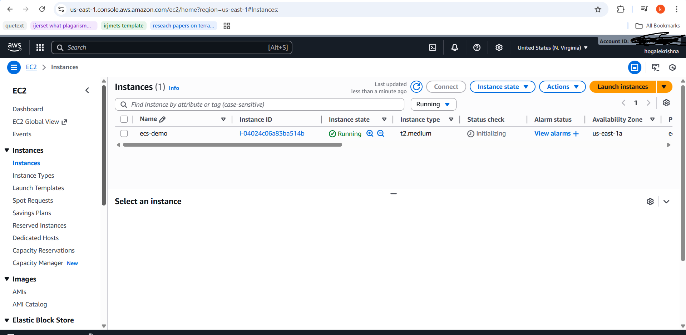
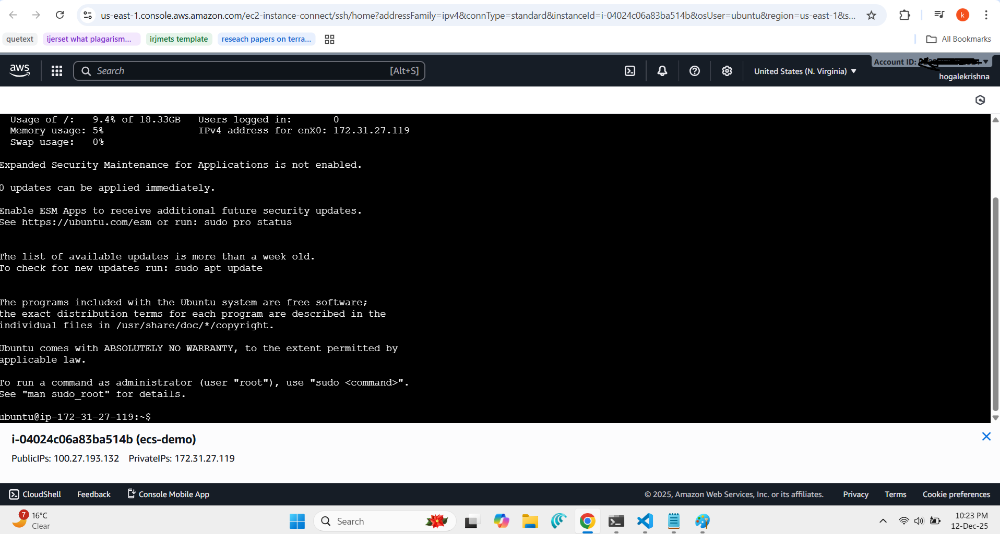
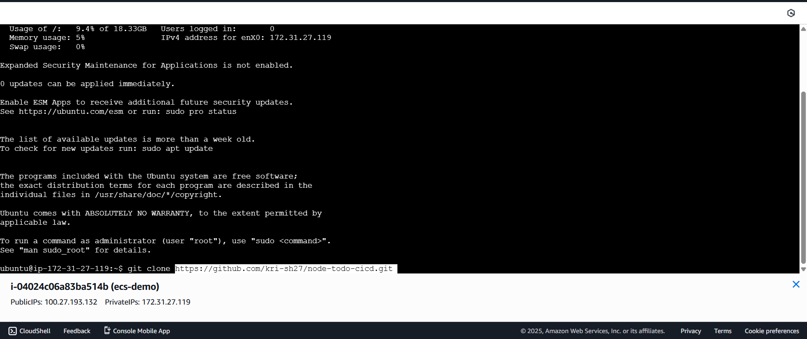
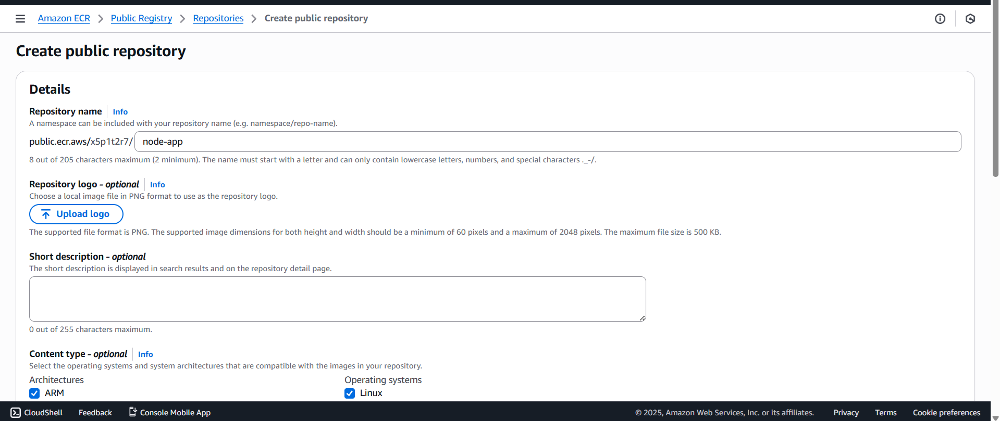
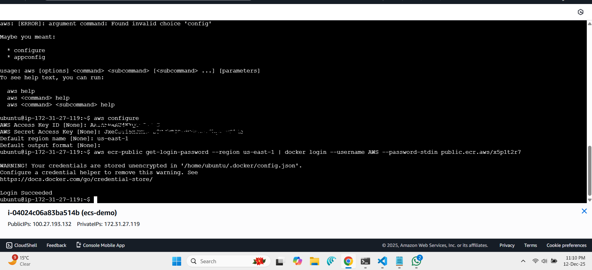
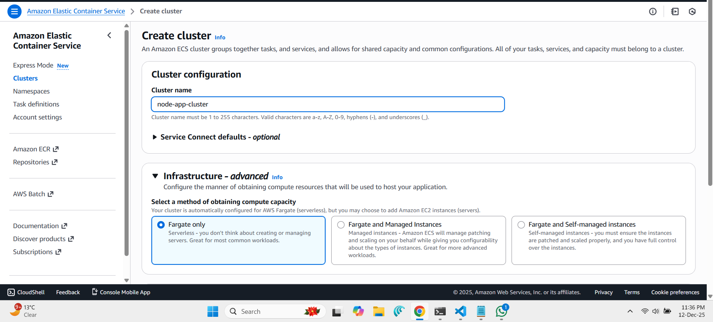
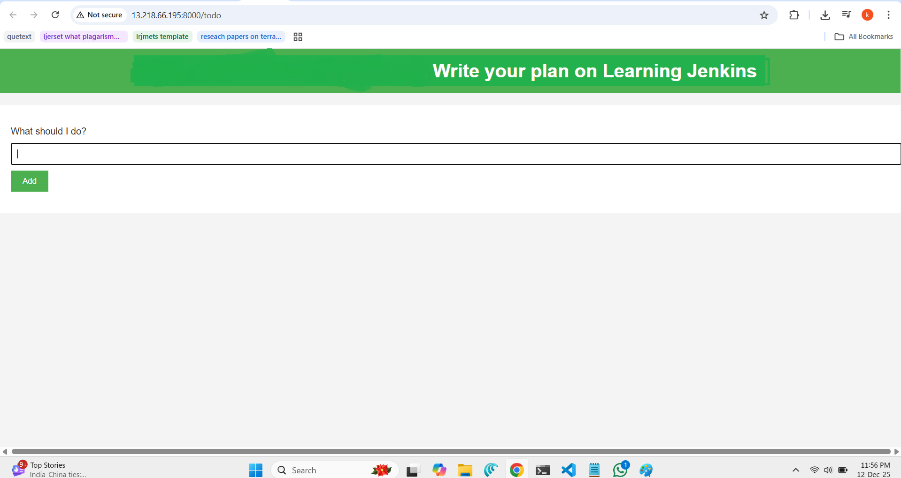

# Deploying a Dockerized Node.js App on AWS Using ECS and ECR
In this blog, I’ll walk through how I deployed my Node.js application from Docker to AWS using Amazon ECS (Elastic Container Service), ECR (Elastic Container Registry), and EC2.  
This hands-on guide is perfect for beginners trying to understand how containers move from local to cloud.

Along the way, I’ll also explain each AWS service, share the exact steps I performed, and highlight common issues learners face.

---

# 🔧 Services Used & Their Purpose

## **1️⃣ Amazon EC2**

**Amazon Elastic Compute Cloud (EC2)** provides virtual machines in the cloud.  
I used EC2 to:

* Install Docker & AWS CLI
    
* Build the Docker image
    
* Push the image to ECR
    
    ---
    

### **Why Use EC2 for Docker Builds?**

We are using EC2 **only as a lightweight build environment** to:

* Install Docker
    
* Clone the application code
    
* Build a Docker image
    
* Push the image to ECR
    

This EC2 machine acts like your **Linux laptop in the cloud**.  
You can perform the *same steps locally* on Ubuntu, PopOS, Debian, Fedora, etc.  
EC2 simply avoids local configuration issues and keeps everything inside AWS.

---

## **2️⃣ Amazon ECR**

**Amazon Elastic Container Registry** is a fully managed Docker image registry.  
I used **Public ECR** to store:

* My Docker image (`node-app`)
    

You push your Docker images to ECR so that ECS can pull & run them.

---

## **3️⃣ Amazon ECS**

**Amazon Elastic Container Service** is a fully managed container orchestration service.  
It allows you to run Docker containers at scale.

In this deployment:

* I created a **cluster**
    
* Then a **task definition**
    
* ECS pulled my image and ran the container
    

---

## **4️⃣ IAM (Identity & Access Management)**

IAM ensures secure access to AWS services.  
Key roles used:

* **IAM user** with ECR permissions
    
* **EC2 role** (optional for automation)
    

Without correct permissions, Docker cannot push to ECR and ECS cannot pull images.

---

# 📝 Step-by-Step Deployment Guide

Below are the **cleaned and corrected steps** of what I performed.

---

# 🖥️ Step 1: Create EC2 Instance

1. Go to **EC2 → Launch Instance**
    
2. Name: `ecs-demo`
    
3. 
<div align="center">
    </div>
    
4. Instance Type: **t2.medium**
    
5. Key Pair: Create a new `.pem` key
    
6. Storage: **20 GB**
    
7. Security Group:
    
    * SSH (22)
        
    * HTTP (80)
        
    * Custom TCP (8000)
        
8. Launch the instance.
    
9. <div align="center">
    </div>
    

---

# 🔌 Step 2: Connect & Install Required Tools

Connect using **EC2 Instance Connect**.

<div align="center">
    </div>

### **Update the system**

```bash
sudo apt update
```

### **Install Docker**

```bash
sudo apt install docker.io -y
sudo usermod -aG docker $USER
```

(Logout & login again or reboot)

### **Install AWS CLI**

Option 1:

```bash
curl "https://awscli.amazonaws.com/awscli-exe-linux-x86_64.zip" -o "awscliv2.zip"
sudo apt install unzip -y
unzip awscliv2.zip
sudo ./aws/install
```

Option 2:

```bash
sudo snap install aws-cli --classic
```

---

# 🧑‍💻 Step 3: Clone Your Node.js Project

<div align="center">
    </div>

```bash
git clone https://github.com/kri-sh27/node-todo-cicd.git
cd node-todo-cicd
```

---

# 🐳 Step 4: Create Public ECR Repository

1. Go to **Amazon ECR**
    
2. Select **Public**
    
3. Create repo → Name: `node-app`
    
4. <div align="center">
    </div>
    
5. Click **View push commands**
    

---

# 🔐 Step 5: IAM User for ECR

Create a new IAM user with permissions:

* `AmazonElasticContainerRegistryPublicFullAccess`
    
* `AmazonElasticContainerRegistryPublicPowerUser`
    
* `AmazonElasticContainerRegistryPublicReadOnly`
    

Then configure:

```bash
aws configure
```

Provide:

* Access key
    
* Secret key
    
* Region (example: `ap-south-1`)
    
* <div align="center">
    </div>
    

---

# 📦 Step 6: Build & Push Docker Image

### **Login to ECR**

(From push commands)

### **Build Docker image**

```bash
docker build -t node-app .
```

### **Tag the image**

```bash
docker tag node-app:latest public.ecr.aws/x5p1t2r7/node-app:latest
```

### **Push to ECR**

```bash
docker push public.ecr.aws/x5p1t2r7/node-app:latest
```

---

# 🚀 Step 7: Deploy on ECS

### **Create Cluster**

1. Go to **Amazon ECS**
    
2. Create cluster → EC2 or Fargate (depending on your setup)
    
3. <div align="center">
    </div>
    

### **Create Task Definition**

Name: `node-todo-app-td`

* Add container:
    
    * Image: [`public.ecr.aws/x5p1t2r7/node-app:latest`](http://public.ecr.aws/x5p1t2r7/node-app:latest)
        
    * Port mapping: **8000**
        

### **Run the Task**

Deploy → Run task

---

# 🌐 Step 8: Access the App

1. Open ECS task
    
2. Copy the **Public IP**
    
3. Open in browser:
    

```bash
http://<public-ip>:8000
Example:
http://13.218.66.195:8000
```

<div align="center">
    </div>

---

# ⚠️ If App Is Not Accessible

This is common.

### Fix:

1. Go to **Task → Configuration**
    
2. Click **ENI ID**
    
3. Open **Security Group**
    
4. Add inbound rule:
    

* Type: Custom TCP
    
* Port: **8000**
    
* Source: 0.0.0.0/0
    

---

# ❗ Common Issues Learners Face (Important!)

### **1\. Docker Permission Denied**

Solution:  
`sudo usermod -aG docker $USER`

### **2\. AWS CLI not installed correctly**

Fix using:  
`sudo snap install aws-cli --classic`

### **3\. ECR push fails — Access Denied**

Cause: Missing IAM permissions.  
Add:

```bash
AmazonElasticContainerRegistryPublicFullAccess
```

### **4\. ECS task fails to start**

Reasons:

* Wrong port exposed
    
* Wrong container image
    
* No internet access in subnet
    

### **5\. App not opening in browser**

Often due to:

* Security group missing port 8000
    
* ENI attached to wrong SG
    
* Container running but app binding to [localhost](http://localhost) only
    

### **6\. Docker image too large**

Optimize by using:

```bash
node:alpine
```

---

# 🎉 Final Thoughts

This Docker → ECR → ECS deployment is a strong foundation for:

* CI/CD pipelines
    
* Microservices deployments
    
* DevOps project building


# node-todo-cicd

Run these commands:


`sudo apt install nodejs`


`sudo apt install npm`


`npm install`

`node app.js`

or Run by docker compose

test

